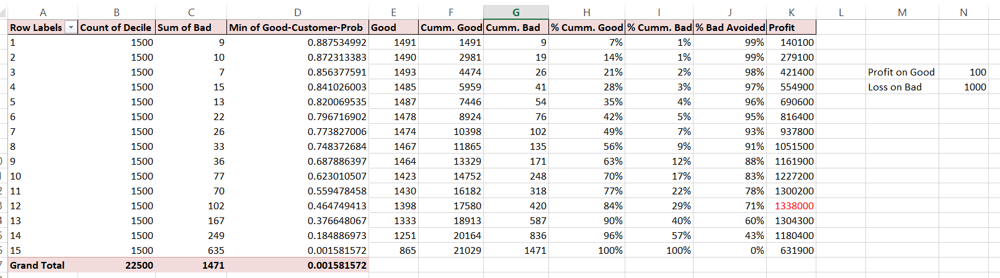
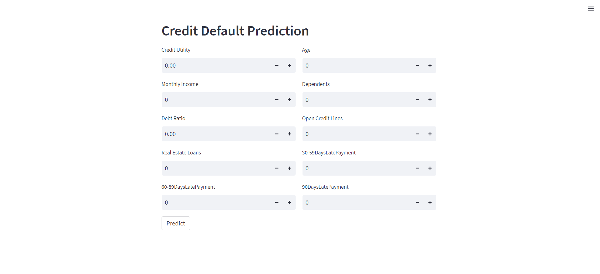
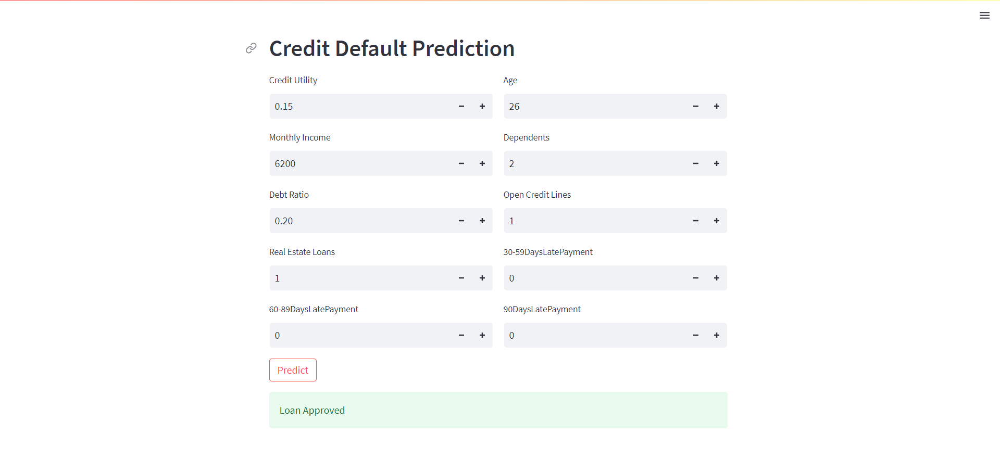
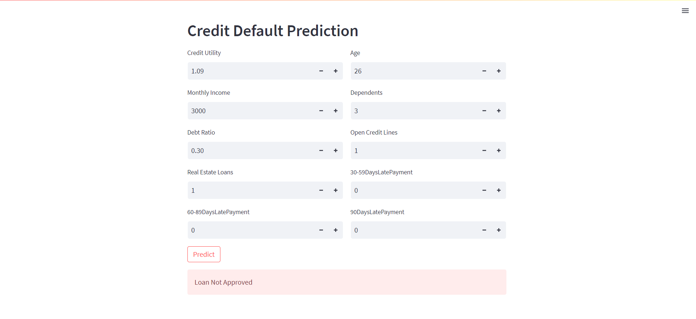

# Credit-Risk-Modelling

[](https://www.python.org/downloads/)

## Table of Contents

- [Overview](#overview)
- [Installation](#installation)
- [Results](#results)

## Overview

Credit risk modeling is a quantitative analysis technique used by financial institutions, such as banks and credit card companies, to assess and predict the likelihood of borrowers defaulting on their loans or credit obligations. The primary goal of credit risk modeling is to make informed lending decisions and manage the risk associated with extending credit to individuals, businesses, or other entities.


## Probability of Dispersing Loan
Although we will be using the ROC-AUC curve (as asked in the Kaggle competition) to determine the best threshold, it is not always the optimal way. In the lending business, there are many factors that we have to account for before deciding the threshold to disperse loans. For example,<br>
1. **The Risk Reward should always be kept in mind**: The profit banks get from lending is the interest which is comparatively lesser than what they lend. So if a person defaults, it directly impacts a bank's profitability.
2. **What type of bank are you?**: Not all banks are the same. Some of them are highly risk-taking, some play safe, and some are in-between.
   1. Usually the new and expanding banks are highly risk-takers. They want to expand their customer base, no matter what. In this scenario, they would lower the threshold to give a loan resulting in more customer exposure.
   2. The well-established banks, those with an already huge customer base, can have the upper hand in choosing the best customers, who are guaranteed to repay their loans. This will reduce the customer exposure but will give the non-default customers, hence less risk.
   3. The moderate-risk banks are somewhere in between the above two. They want to expand but do not want much to expose themselves to subprime loans.<br>
  
<br>
In the above image, we can change the profit/loss amount and accordingly, the best threshold can be calculated. In ROC-AUC, the threshold was determined solely based on how is it performing on confusion matrix. But here the threshold changes as we change the amounts.

## Installation

List the steps required to install and set up your project. Include any prerequisites or dependencies. You can use bullet points for clarity:

```shell
1. Clone this repository: `git clone https://github.com/poolkit/Credit-Risk-Modelling.git`
2. Navigate to the project directory: `cd credit-risk-modeling`
3. Install the required dependencies: `pip install -r requirements.txt`
```

## Results
Run the streamlit app.

```shell
streamlit run app.py
```





